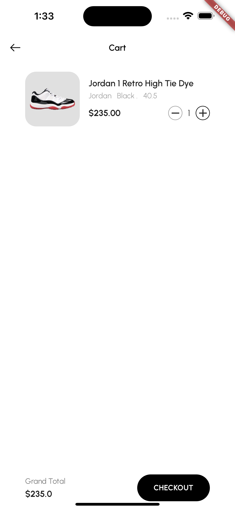

## Project Name: PrioritySoft Test

### Project Setup Instructions:

1. **Flutter Setup:**
   - Ensure you have Flutter installed. If not, follow the instructions [here](https://flutter.dev/docs/get-started/install) to set up Flutter on your machine.
   - Clone this repository to your local machine using:
     ```
     git clone <repository_url>
     ```
   - Navigate to the project directory in your terminal.

2. **Firebase Setup:**
   - Obtain the necessary Firebase configuration files.
   - Contact the project administrator to provide the `.env` file with the Firebase configuration details. It should include the following fields:
     ```
     ANDROID_API_KEY=<your_android_api_key>
     ANDROID_APP_ID=<your_android_app_id>
     ANDROID_SENDER_ID=<your_android_sender_id>
     ANDROID_PROJECT_ID=<your_android_project_id>
     ANDROID_STORAGE_BUCKET=<your_android_storage_bucket>
     
     IOS_API_KEY=<your_ios_api_key>
     IOS_APP_ID=<your_ios_app_id>
     IOS_SENDER_ID=<your_ios_sender_id>
     IOS_PROJECT_ID=<your_ios_project_id>
     IOS_STORAGE_BUCKET=<your_ios_storage_bucket>
     IOS_BUNDLE_ID=<your_ios_bundle_id>
     ```
   - Place the `.env` file in the root directory of the project.

3. **Running the Application:**
   - Once Flutter and Firebase are set up, you can run the application on a simulator or a physical device using:
     ```
     flutter run
     ```

### Assumptions Made During Development:

- **Design Compliance:** The development was carried out under the assumption that the design provided in Figma would be strictly followed. However, minor adjustments or enhancements were permitted to improve user experience and functionality.
  
- **Dynamic Content:** It was assumed that most of the content within the application needed to be dynamic. Therefore, Firebase integration was prioritized to facilitate seamless management and updating of content.

### Challenges Faced and Overcoming Them:

During the development phase, one of the significant challenges encountered was the establishment of relationships between different collections in Firestore. Coming from a background predominantly working with SQL databases, the inherent limitations of NoSQL databases like Firestore posed a considerable challenge. However, this obstacle was overcome by thoroughly understanding Firestore's document-based structure and leveraging its capabilities effectively. Through meticulous setup and structuring of Firestore collections, the required relationships were established, ensuring efficient data management and retrieval within the application.

### Additional Features or Improvements:

- **Firestore Integration:** Extensive integration with Firestore was implemented to enable real-time data synchronization and seamless content management.
  
- **Optimized Performance:** Implementation of performance optimization techniques to ensure smooth application operation and responsiveness across various devices and platforms.

---

## App Showcase

### Video Demonstration

[](https://youtube.com/shorts/ga53op1yx4k)

Check out our app showcase video to see a demonstration of its features and functionalities in action!

### App Showcase Image

<div style="display: flex; justify-content: center;">
    
    
    
    
    
    
</div>


Above are images showcasing our app's design and features.

### Updated Reviews

We've recently updated the app's reviews! Using a Python script, we've added 1045 new reviews to our database. Here's the script used:

```python
import firebase_admin
from firebase_admin import credentials, firestore
import random
from faker import Faker
import datetime
import requests

cred = credentials.Certificate("serviceaccountkey.json")
firebase_admin.initialize_app(cred)
db = firestore.client()

fake = Faker()

def generate_random_review():
    user_name = fake.name()
    rating = random.randint(1, 5)
    comment = fake.paragraph()
    profile_picture_url = get_random_profile_picture()
    timestamp = datetime.datetime.now()
    return {
        "user_name": user_name,
        "rating": rating,
        "comment": comment,
        "profile_picture_url": profile_picture_url,
        "timestamp": timestamp
    }

def get_random_profile_picture():
    response = requests.get("https://randomuser.me/api/?inc=picture")
    data = response.json()
    profile_picture_url = data["results"][0]['picture']['large']
    return profile_picture_url
    
def populate_reviews():
    for _ in range(1044):
        review_data = generate_random_review()
        db.collection("reviews").add(review_data)

if __name__ == "__main__":
    populate_reviews()

